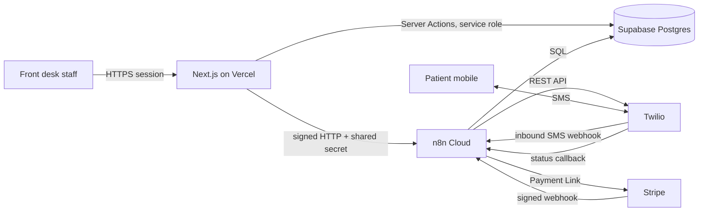

# architecture.md

## 1. Purpose

Ghost-Buster fills last-minute dental cancellations. Front desk clicks one button; the system texts a ranked waitlist in escalating waves; the first valid reply wins the slot atomically.

Single-tenant. One installation serves exactly one clinic. All infrastructure is owned by the clinic. There is no cross-clinic tenancy anywhere in the data model.

## 2. System context



## 3. Components and responsibilities

| Component | Hosts | Owns | Must never |
| --- | --- | --- | --- |
| Next.js / Vercel | Dashboard, inbox UI, CSV import, Server Actions | Synchronous staff experience | Run long jobs, hold secrets client-side |
| n8n Cloud | Waves, delays, recalls, review requests, inbound processing, Stripe flow | Asynchronous event loop | Decide slot winners in workflow logic |
| Supabase Postgres | All tables, RLS, claim function | Single source of truth | Be reachable anonymously |
| Twilio | Outbound SMS, inbound routing, status callbacks | Communications | Receive PHI in message bodies |
| Stripe (V2, flagged) | Deposit holds | Payment state | Be trusted without signature verification |

## 4. Execution model

The system splits on one axis: **does the user wait for it?**

**Synchronous (Next.js Server Actions)** — anything the staff member watches complete. Campaign creation, CSV upsert, manual inbox reply, pause/cancel, settings changes, dashboard reads. Budget: under 800ms p95.

**Asynchronous (n8n Cloud)** — anything involving waiting, retrying, or an external callback. Wave escalation with 7-minute delays, inbound message processing, delivery status ingestion, daily recall sweeps, scheduled review requests, Stripe reservation expiry.

The two halves communicate only through Postgres and through signed webhook calls. Neither holds state the other needs in memory.

<aside>
🔒

**Claim atomicity is the spine of this system.** Two patients will reply "YES" within the same second. Correctness comes from one conditional `UPDATE` in Postgres, not from ordering, locking in application code, or n8n execution sequence.

</aside>

## 5. Core flows

### 5.1 CSV import

1. Staff drags a Dentrix/Eaglesoft export onto the import screen.
2. Papa Parse reads it **in browser memory**. The raw file is never uploaded.
3. UI requires explicit column mapping (name, phone, last visit, procedure).
4. Client-side validation: normalize phone to E.164, flag invalid rows, detect in-file duplicates.
5. Only validated rows POST to an authenticated Server Action.
6. Server upserts in batches of 500 on `phone_number` conflict, preserving existing `opted_out` and `consent_status`.
7. Server writes one `import_batches` row and one `audit_events` row.
8. UI reports inserted / updated / skipped / invalid counts.

### 5.2 Campaign creation and wave 1

1. Staff picks a slot template (`Hygiene — 60 min`) and an appointment time.
2. Server Action inserts `broadcast_campaigns` with `status = 'DRAFT'`, resolves `clinic_timezone` server-side.
3. Server Action validates quiet hours. If outside sending window, campaign stays `DRAFT` and UI explains why.
4. Server Action calls n8n `POST /webhook/campaign-start` with campaign id, signed with `N8N_SHARED_SECRET`.
5. n8n selects wave-1 patients (see 5.3 selection rules), inserts `campaign_recipients` rows **before sending**, sets campaign to `OPEN`.
6. n8n sends via Twilio Messaging Service, one request per recipient, writing `sms_logs` on each response.

### 5.3 Escalating waves

Wave plan is stored per campaign as JSON so clinics can tune it without a code change. Default: 3 patients, wait 7 min, 5 patients, wait 7 min, 10 patients, wait 10 min, then expire.

Selection query per wave, in order of precedence:

- `opted_out = false` and `consent_status = 'GRANTED'`
- not already in `campaign_recipients` for this campaign
- not messaged more than `MAX_MESSAGES_PER_WEEK` in the trailing 7 days
- procedure fit against the campaign's `procedure_type`
- `ORDER BY reliability_score DESC, last_visit_date ASC`

<aside>
⚠️

**After every Wait node, re-query the campaign row.** n8n resumes with the payload it had 7 minutes ago. If `status` is no longer `OPEN` or `ESCALATING`, terminate the branch silently. Staff fill chairs manually and this is the most common source of embarrassing double-booking.

</aside>

### 5.4 Inbound claim — first reply wins

1. Twilio POSTs to the n8n inbound webhook.
2. **Verify the Twilio signature.** Reject unsigned requests before any DB write.
3. Insert into `sms_logs` with `direction = 'INBOUND'`, unique on `message_sid`. A conflict means this is a Twilio retry — stop here.
4. Normalize the phone to E.164 and uppercase-trim the body.
5. If body matches an opt-out or help keyword, branch to 5.6.
6. If body normalizes to an affirmative (`YES`, `Y`, `YEP`, `CLAIM`, `1`), find the patient's most recent eligible campaign in `OPEN` or `ESCALATING`.
7. Execute the atomic claim. If it returns a row, this patient won: send confirmation, set `next_wave` branches to terminate.
8. If it returns zero rows, someone else won: send the polite already-filled reply.
9. If the body is anything else, insert into `unhandled_inbox` with `status = 'UNREAD'`.

### 5.5 Unhandled inbox

Inbound non-command messages land in `unhandled_inbox`. The dashboard subscribes via Supabase Realtime (fall back to 15s polling if the connection drops) and shows an unread badge. Staff can reply, assign, and resolve. Manual replies go out through a Server Action → n8n → Twilio, and are recorded in both `sms_logs` and `audit_events`.

### 5.6 Opt-out and opt-in

Handle `STOP`, `STOPALL`, `UNSUBSCRIBE`, `CANCEL`, `END`, `QUIT` → set `opted_out = true`, `consent_status = 'REVOKED'`. Handle `START`, `UNSTOP`, `YES` **only when no active campaign exists** → clear opt-out. Handle `HELP`/`INFO` → static help reply. Twilio also enforces these at the carrier level; mirror them in your DB so wave selection excludes them.

### 5.7 Delivery status

Twilio status callbacks hit a separate n8n webhook. Upsert `sms_logs` by `message_sid`, advancing `QUEUED → SENT → DELIVERED` or terminal `UNDELIVERED` / `FAILED` with `error_code`. Never regress a terminal status. Undelivered wave-1 recipients should not block escalation.

### 5.8 Automated recalls (V2)

Daily n8n Schedule trigger. Query patients whose `last_visit_date` falls in a **range** (`recall_threshold_days` to `recall_threshold_days + 14`) and who have no recall in `RECALL_COOLDOWN_DAYS`. Range-based, never exact-day equality — one failed run must not permanently skip a cohort.

### 5.9 Review requests (V2)

Staff marks an appointment complete. n8n schedules a request after `REVIEW_DELAY_HOURS`. Record the send and enforce a per-patient cooldown. Review links must contain no patient identifiers.

### 5.10 Stripe deposit holds (V2, feature-flagged)

For high-value slots: reserve as `PENDING_PAYMENT` with `claim_expires_at`, send a unique Payment Link, verify the signed Stripe webhook, promote to `FILLED` only on successful payment. On expiry or failure, release the reservation and resume escalation from the current wave.

## 6. Trust boundaries

| Boundary | Control |
| --- | --- |
| Browser → Server Action | Supabase Auth session, role check, Zod input validation |
| Browser → Postgres | Blocked. RLS deny-by-default; anon key grants nothing |
| Next.js → n8n | `X-Ghostbuster-Signature` HMAC over the raw body plus timestamp; reject skew over 5 min |
| Twilio → n8n | Twilio signature validation on every request |
| Stripe → n8n | Stripe signature validation on every event |
| n8n → Postgres | Dedicated service credential stored in n8n Credentials Manager |

### 6.1 Supabase client separation

The application uses two credential tiers and never mixes them:

- `lib/supabase/server.ts` uses the service-role key for server-only database work.
- Anon-key clients remain RLS-scoped:
  - `lib/supabase/auth-server.ts` is request-scoped and cookie-aware for server-side Auth only.
  - `lib/supabase/client.ts` is browser-only and reserved for Realtime.

See `docs/decisions/0001-supabase-ssr-auth-client.md` for the Phase 3 decision record.

## 7. Environment variables

**Vercel (all server-side; nothing prefixed `NEXT_PUBLIC_` except the two marked)**

```
SUPABASE_URL
SUPABASE_SERVICE_ROLE_KEY
NEXT_PUBLIC_SUPABASE_URL         # SSR Auth and browser Realtime
NEXT_PUBLIC_SUPABASE_ANON_KEY    # SSR Auth and browser Realtime, RLS-scoped
N8N_BASE_URL
N8N_SHARED_SECRET
CLINIC_NAME
CLINIC_TIMEZONE
QUIET_HOURS_START
QUIET_HOURS_END
MAX_MESSAGES_PER_WEEK
ESTIMATED_CHAIR_VALUE
FEATURE_STRIPE_DEPOSITS
FEATURE_RECALLS
FEATURE_REVIEWS
```

**n8n Credentials Manager (never in HTTP node bodies — plaintext keys are not stripped on export)**

```
Twilio account SID + auth token + Messaging Service SID
Supabase Postgres connection string
Stripe secret key + webhook signing secret
GHOSTBUSTER_SHARED_SECRET
```

## 8. Invariants

1. Slot claiming is exactly one conditional `UPDATE`. Zero rows updated means the caller lost.
2. `campaign_recipients` rows are inserted **before** the Twilio call, so a crash cannot cause a re-send.
3. Every webhook handler is idempotent on a provider-supplied id.
4. Every delayed execution re-reads campaign state before acting.
5. Quiet hours and frequency caps are evaluated server-side against `CLINIC_TIMEZONE`.
6. `sms_logs.status` never moves backwards from a terminal state.
7. No secret is exposed with a `NEXT_PUBLIC_` prefix.
8. A single kill switch pauses all outbound automation.

## 9. Failure modes

| Failure | Mitigation |
| --- | --- |
| Twilio retries inbound webhook | Unique `message_sid`; conflict short-circuits |
| Two patients reply simultaneously | Atomic conditional `UPDATE` |
| Staff fills chair during a Wait | Post-wait state re-check terminates the branch |
| n8n workflow errors mid-wave | Error workflow alerts + campaign stays claimable; recipients already inserted prevent duplicates |
| n8n Cloud outage | Campaigns stall in `OPEN`; dashboard surfaces stalled-campaign warning; manual send fallback |
| Twilio number unregistered (10DLC) | Pre-flight check in acceptance tests; delivery failures alert |
| Bad CSV | Client-side validation blocks import; per-row error report |
| Runaway sending | `MAX_MESSAGES_PER_WEEK` cap plus global kill switch |
| Stripe link expires | Reservation released, escalation resumes |

## 10. Repo structure

```
app/
  (auth)/login/page.tsx
  (app)/dashboard/page.tsx
  (app)/campaigns/[id]/page.tsx
  (app)/inbox/page.tsx
  (app)/patients/page.tsx
  (app)/patients/import/page.tsx
  (app)/settings/page.tsx
  actions/campaigns.ts
  actions/patients.ts
  actions/inbox.ts
  actions/settings.ts
lib/
  supabase/server.ts        # service-role client, server-only
  supabase/auth-server.ts   # request-scoped anon client, Auth only
  supabase/client.ts        # anon client, Realtime only
  n8n/client.ts             # signed webhook caller
  phone.ts                  # E.164 normalization
  keywords.ts               # STOP/START/YES normalization
  quiet-hours.ts
  schemas.ts                # Zod
components/
supabase/migrations/
n8n/waitlist-engine.json
docs/                       # these six files plus accepted decision records
```

## 11. Out of scope for V1

Direct Dentrix/Eaglesoft API integration. Voice and email campaigns. AI clinical advice. Writing back into the practice management system. Multi-clinic tenancy in one install. Insurance or billing automation. Ongoing developer access absent a support agreement.
