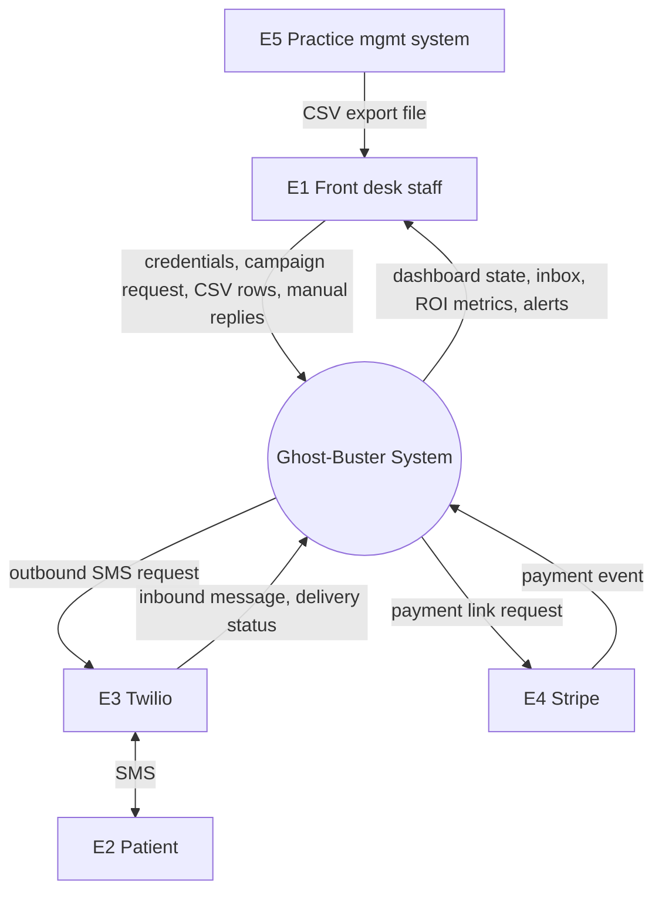
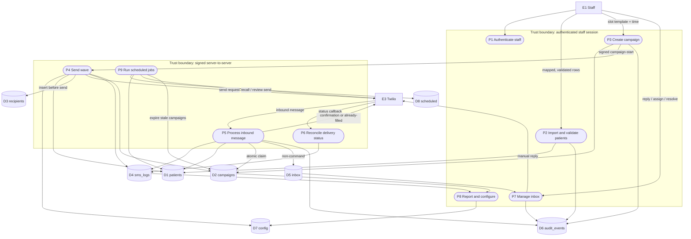
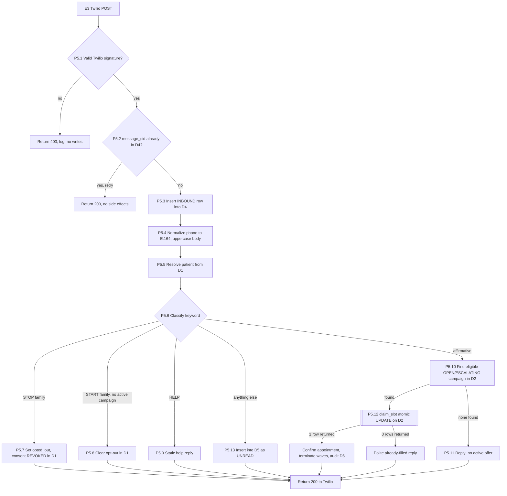
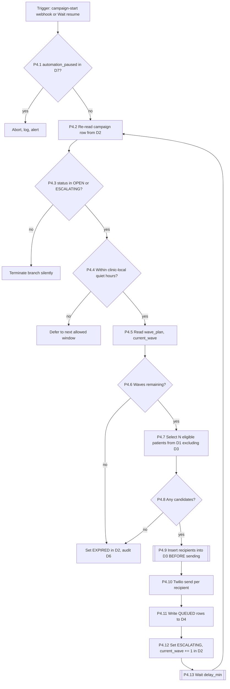
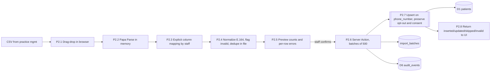

# dfd.md

## Notation

Gane-Sarson style, rendered in Mermaid.

- **External entity** — actor or third party outside the trust boundary (rectangle)
- **Process** — numbered transformation `P1`, `P1.2` (rounded)
- **Data store** — persistent state `D1` (cylinder)
- **Data flow** — labeled arrow describing the payload, not the mechanism
- **Trust boundary** — dashed subgraph; every crossing needs authentication

## Data stores

| ID | Store | Contents |
| --- | --- | --- |
| D1 | `patients` | Identity, phone, consent, opt-out, reliability |
| D2 | `broadcast_campaigns` | Slot state machine, wave plan, winner |
| D3 | `campaign_recipients` | Who was contacted in which wave |
| D4 | `sms_logs` | Every message in and out, delivery state |
| D5 | `unhandled_inbox` | Inbound messages needing a human |
| D6 | `audit_events` | Immutable action trail |
| D7 | `clinic_config`  • `slot_templates` | Tunables, quiet hours, kill switch |
| D8 | `scheduled_messages` | Pending recalls and review requests |

## External entities

| ID | Entity |
| --- | --- |
| E1 | Front desk staff |
| E2 | Patient (mobile phone) |
| E3 | Twilio |
| E4 | Stripe (V2) |
| E5 | Practice management system (Dentrix / Eaglesoft) — CSV export only, no API |

## Level 0 — context diagram

The practice management system never connects directly. A human exports a CSV and imports it — that is the deliberate V1 boundary.

## Level 1 — major processes

### Process ownership

| Process | Runs in | Trigger |
| --- | --- | --- |
| P1 Authenticate | Next.js middleware + Supabase Auth | Page request |
| P2 Import patients | Browser parse → Server Action | Staff upload |
| P3 Create campaign | Server Action | Staff click |
| P4 Send wave | n8n | Webhook from P3, or post-Wait resume |
| P5 Process inbound | n8n | Twilio webhook |
| P6 Reconcile status | n8n | Twilio callback |
| P7 Manage inbox | Server Action + Realtime | Staff action |
| P8 Report / configure | Server Component read | Page load |
| P9 Scheduled jobs | n8n Schedule trigger | Daily / delayed |

## Level 2 — P5 inbound message processing

The highest-risk process in the system. Every branch matters.

<aside>
🔒

P5.12 is the only place a slot winner is decided. No other process may write `status = 'FILLED'` except the manual-assign path, which uses the same conditional guard.

</aside>

## Level 2 — P4 wave engine

<aside>
⚠️

The loop returns to **P4.2**, never to P4.5. Re-reading state after the Wait is what makes manual fills, cancellations, and kill-switch flips take effect mid-campaign.

</aside>

## Level 2 — P2 CSV import

The raw file never leaves the browser as an upload, and an import can never resurrect a patient who has opted out.

## Trust boundary crossings

| # | Crossing | Auth mechanism | Failure action |
| --- | --- | --- | --- |
| 1 | Browser → Server Action | Supabase Auth session + active-staff role check | Redirect to login |
| 2 | Browser → Supabase Realtime | Anon key, RLS select-only on 3 tables | Subscription denied |
| 3 | Next.js → n8n | HMAC over raw body + timestamp, 5-min skew window | 401, no workflow run |
| 4 | Twilio → n8n inbound | Twilio signature validation | 403 before any write |
| 5 | Twilio → n8n status | Twilio signature validation | 403 |
| 6 | Stripe → n8n | Stripe signature validation | 400 |
| 7 | n8n → Postgres | Credentials Manager connection string | Connection refused |
| 8 | n8n → Twilio | Credentials Manager account SID + token | Send fails, alert |

## Data dictionary — key flows

| Flow | Fields | Sensitivity |
| --- | --- | --- |
| Validated CSV rows | name, phone E.164, last visit date, procedure | PII, PHI-adjacent |
| Campaign-start webhook | campaign id, HMAC signature, timestamp | Low |
| Outbound offer SMS | clinic name, time, procedure label, reply instruction | **Minimize** — no clinical detail |
| Inbound message | from phone, body, message SID | PII, possibly PHI (patients volunteer symptoms) |
| Status callback | message SID, status, error code | Low |
| Claim result | boolean, campaign id, appointment time | Low |
| Confirmation SMS | clinic name, confirmed time | Minimize |
| Dashboard read | aggregate counts, campaign rows, patient names | PII |

## PHI classification

<aside>
🩺

**Assume PHI exists in D1, D4, D5, and D6.** A phone number tied to a dental appointment is PHI under HIPAA. Inbound free-text is the worst case — patients will describe symptoms unprompted, and that text lands in `unhandled_inbox` and `sms_logs`.

</aside>

Controls that follow from this:

- Outbound bodies carry no diagnosis, procedure detail beyond a generic label, or provider notes.
- No patient identifier in any URL, including review links and payment links.
- `sms_logs.message_body` redacted after 90 days; only metadata survives.
- Application logs never include full phone numbers or message bodies. Log the last four digits and the message SID.
- Vercel offers no BAA on Hobby or Pro — keep PHI out of request logs, and keep this on the counsel checklist.

## Trust boundary risks to test

| Risk | Test |
| --- | --- |
| Forged inbound webhook | POST without a Twilio signature; expect 403 and zero DB writes |
| Replayed inbound message | POST the same `message_sid` twice; expect one claim, one log row |
| Race on one slot | Two simultaneous YES replies; expect one winner, one already-filled reply |
| Anon key escalation | Attempt insert/update with the anon key; expect denial on every table |
| Cron/webhook auth bypass | Call the n8n webhook without the shared secret; expect rejection |
| Quiet-hours bypass | Create a campaign at 02:00 clinic time; expect deferral, not a send |
| Opt-out resurrection | Re-import a CSV containing an opted-out patient; expect opt-out preserved |